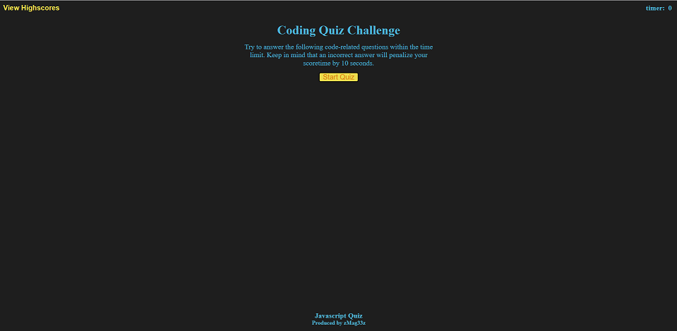
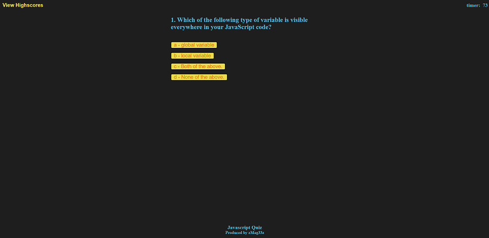
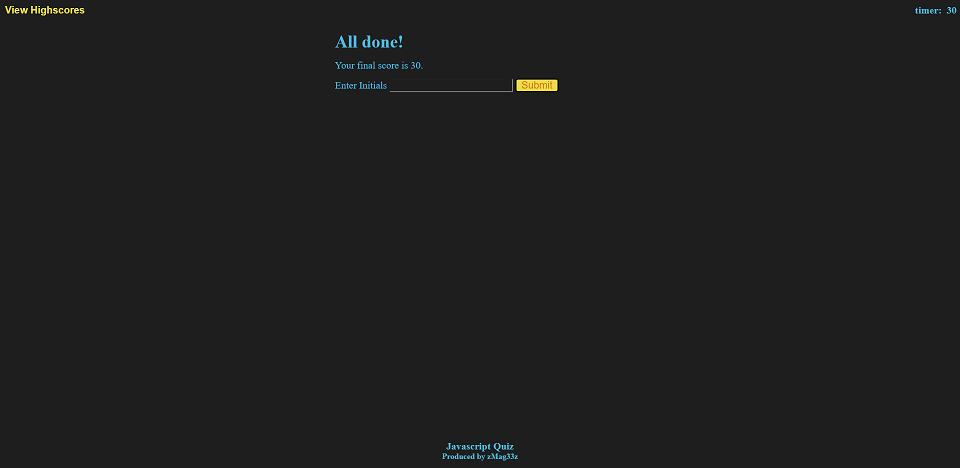
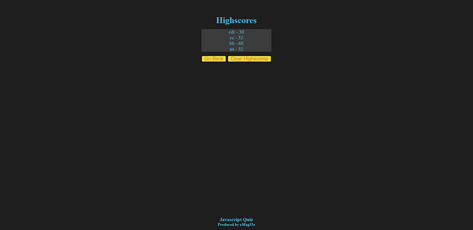

# Javascript Quiz

## Description

Short five question quiz over Javascript.

## Table of contents

- [Installation](#installation)
- [Usage](#usage)
- [Credits](#credits)
- [License](#license)

## Installation

N/A

## Usage

Welcome to the Coding Quiz Challenge.  Just a five question quiz on basic topics over Javascript.  Time is essential for it is your score.  As you answer questions the time counts down.  If you get an answer incorrect.  You will be penalized ten seconds from the time.  At the end of the Quiz you may record your highscore.

## Credits

[Tutorials Point](https://www.tutorialspoint.com/javascript/javascript_online_quiz.htm)(Questions used)

[Code Explained](https://www.youtube.com/watch?v=49pYIMygIcU&t=1431s)(Key and Function step help)

[{RhymBill}](https://www.youtube.com/watch?v=2hJ1rTANVnk)(Key to Local storage array)

## This site.

[Javascript Quiz](https://zmag33z.github.io/week-4-challenge/)

## License

### [MIT License Copyright (c) 2022](https://zmag33z.github.io/week-4-challenge/license.md)